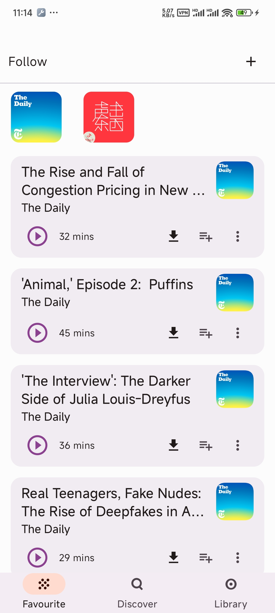
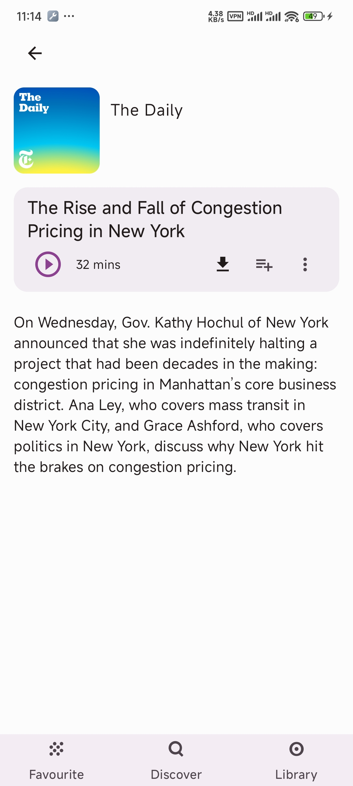
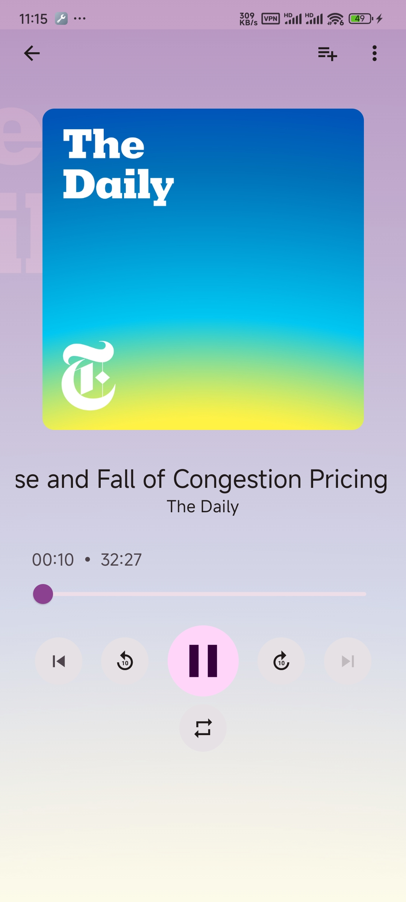
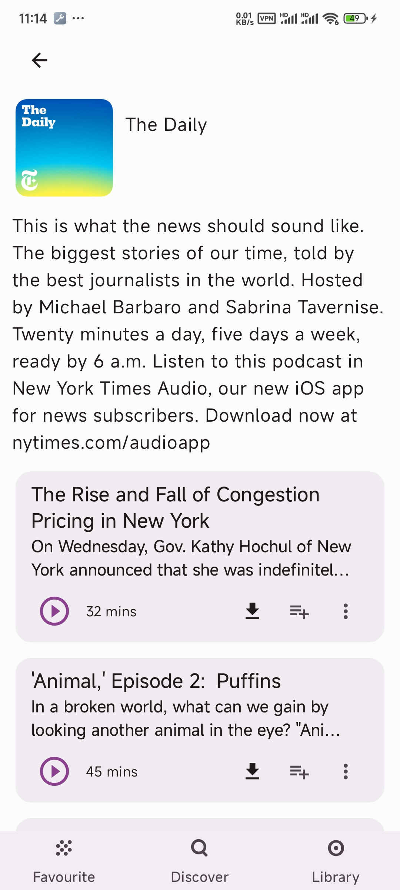

a podcast application to provide a seamless user experience, built entirely with Kotlin and Jetpack Compose.

## Tech stack & Open-source libraries
- Minimum SDK level 26
- [Kotlin](https://kotlinlang.org/) based, [Coroutines](https://github.com/Kotlin/kotlinx.coroutines) + [Flow](https://kotlin.github.io/kotlinx.coroutines/kotlinx-coroutines-core/kotlinx.coroutines.flow/) for asynchronous.
- Jetpack
  - Lifecycle: Observe Android lifecycles and handle UI states upon the lifecycle changes.
  - ViewModel: Manages UI-related data holder and lifecycle aware. Allows data to survive configuration changes such as screen rotations.
  - DataBinding: Binds UI components in your layouts to data sources in your app using a declarative format rather than programmatically.
  - Room: Constructs Database by providing an abstraction layer over SQLite to allow fluent database access.
  - [Hilt](https://dagger.dev/hilt/): for dependency injection.
- Architecture
  - MVVM Architecture (View - DataBinding - ViewModel - Model)
  - Repository Pattern
- [Material-Components](https://github.com/material-components/material-components-android): Material design components for building ripple animation, and CardView.
- [Timber](https://github.com/JakeWharton/timber): A logger with a small, extensible API.
